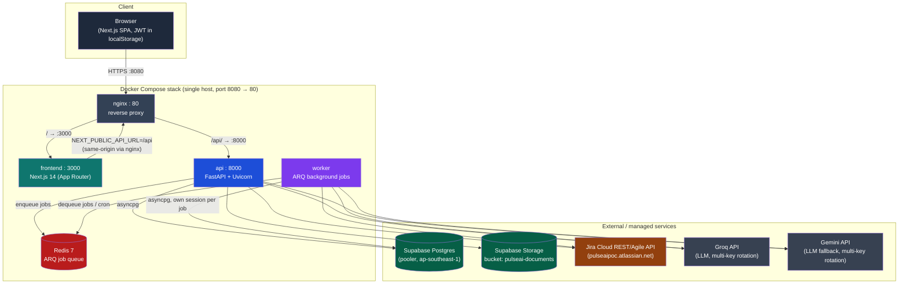
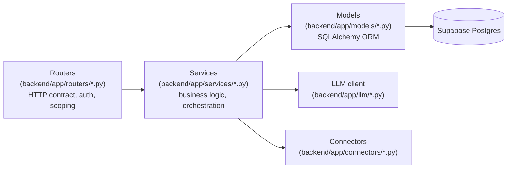
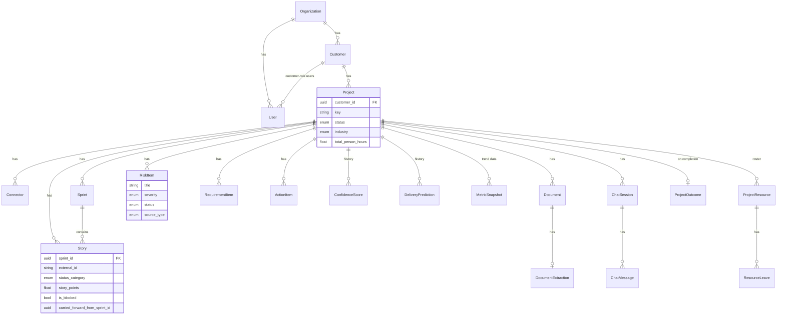
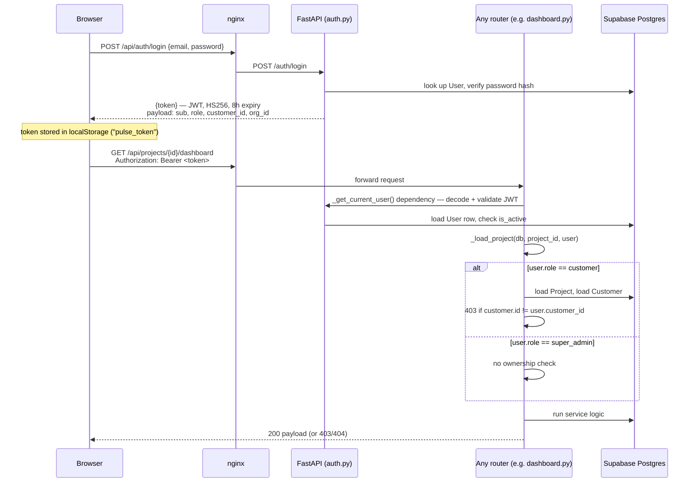
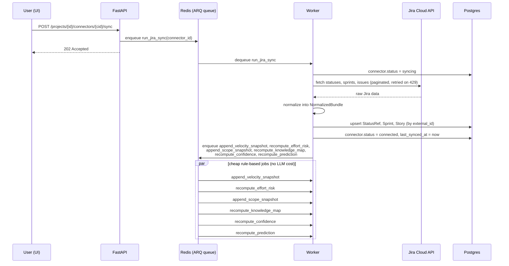
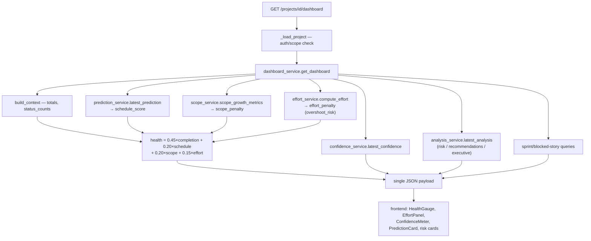
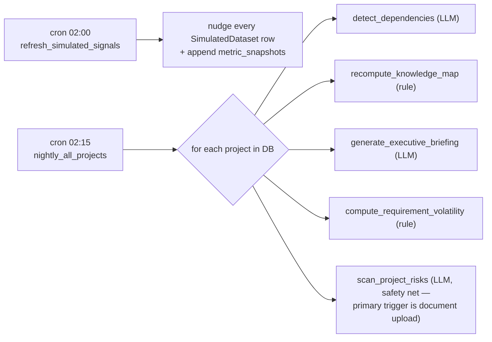
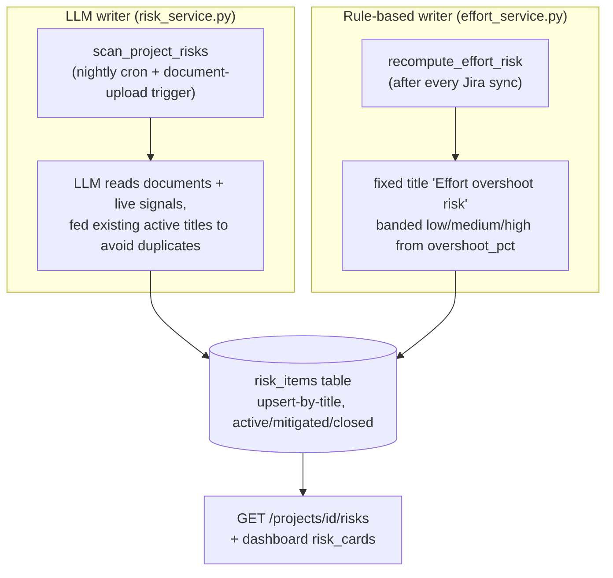
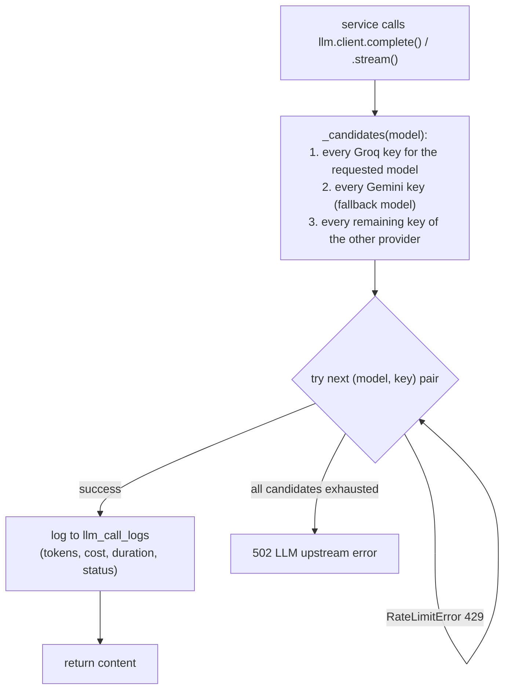
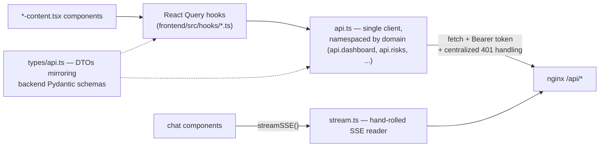

# PulseAI — Technical Architecture

*Status: reflects the implementation as of this document's creation. PulseAI is an active WIP POC — see [Known limitations](#known-limitations--current-state) for what's intentionally not built yet.*

## 1. What PulseAI is

PulseAI is a delivery-intelligence platform for Agile software projects. It syncs real delivery data (Jira today, more connectors planned), computes health/risk/effort/confidence signals from that data instead of manual reporting, and exposes it through an executive dashboard and a role-scoped "Ask PulseAI" chat assistant — for both the delivery team (super_admin) and the customer paying for the project (customer role).

## 2. High-level architecture



**Note on the Postgres/Redis containers**: `docker-compose.yml` defines a local `postgres` and `redis` service (with healthchecks), but `backend/.env` sets `DATABASE_URL` to a remote **Supabase** Postgres pooler connection — the app actually talks to Supabase, not the bundled local Postgres container. Redis *is* actually used locally, for the ARQ queue. This is a real, current inconsistency worth cleaning up (either drop the unused local `postgres` service, or make Supabase-vs-local switchable via env).

## 3. Deployment topology

| Service | Image / build | Listens on | Depends on | Purpose |
|---|---|---|---|---|
| `nginx` | `nginx:1.27-alpine` | host `8080` → container `80` | api (healthy), frontend (started) | Single entrypoint; routes `/api/*` to backend, everything else to frontend. Buffering disabled + 300s read timeout on `/api/` to support SSE streaming (chat/analysis). |
| `frontend` | `./frontend/Dockerfile` (Node 20) | `3000` (internal) | api (healthy) | Next.js 14 App Router SPA. `NEXT_PUBLIC_API_URL=/api` is baked in at **build time** via Docker `ARG`/`ENV` (a past bug: it was previously read at runtime, causing stale API URLs — fixed). |
| `api` | `./backend/Dockerfile` (Python 3.12) | `8000` (internal) | postgres (healthy, unused — see above), redis (healthy) | FastAPI app, `uvicorn app.main:app`. Auto-runs Alembic migrations + seed on boot. Healthcheck hits `/healthz`. |
| `worker` | same image as `api` | — (no HTTP port) | postgres (healthy), redis (healthy) | Runs `arq app.worker.WorkerSettings` — the ARQ job consumer + cron scheduler. Healthcheck disabled (nothing listens on 8000 in this container). |
| `postgres` | `postgres:16-alpine` | `5432` | — | Defined in compose but **not actually used** by the app (see note above); `DATABASE_URL` points to Supabase instead. |
| `redis` | `redis:7-alpine` | `6379` | — | Backs the ARQ job queue; password-protected via `REDIS_PASSWORD`. Actually used. |

`docker-compose.override.yml` remaps nginx to host port `8080` (so the stack can run alongside other services on the same box without conflicting on 80).

## 4. Backend architecture (`backend/app/`)

### 4.1 Layering



Routers never touch the DB or call the LLM directly — they resolve the current user, enforce scoping (`_load_project`, `_scope`), and delegate to a service function. Services contain all business logic and are the only layer that talks to models/DB, the LLM client, or connectors. This is a strict, consistently-applied separation across the whole backend.

### 4.2 Routers → endpoints (`backend/app/routers/`)

| Router | Key endpoints |
|---|---|
| `auth.py` | `POST /auth/login`, `GET /auth/me`, `PUT /auth/me/password` |
| `customers.py` | `GET/POST /customers`, `GET/PATCH /customers/{id}` |
| `projects.py` | `GET /customers/{id}/projects`, `GET/PATCH /projects/{id}`, `POST/GET /projects/{id}/outcome`. Also defines the shared `_load_project()` scoping helper used across nearly every other router. |
| `connectors.py` | `GET/POST /projects/{id}/connectors`, `.../test`, `.../sync` (enqueues `run_jira_sync`), `.../status`; `GET /projects/{id}/sprints`, `.../stories` |
| `analysis.py` | `POST/GET /projects/{id}/analysis/{kind}`, `POST/GET .../analysis/{analysis_id}/judge` |
| `documents.py` | `GET/POST /projects/{id}/documents`, `GET/DELETE /documents/{id}`, `GET /projects/{id}/requirements/drift` |
| `confidence.py` | `POST /projects/{id}/confidence/compute`, `GET /projects/{id}/confidence`, `POST /projects/{id}/alignment` |
| `dashboard.py` | `GET /projects/{id}/dashboard`, `GET /projects/{id}/scope-creep` |
| `resources.py` | `GET /projects/{id}/resources` (risk view) + full roster/leave CRUD |
| `dependencies.py` | `GET /projects/{id}/dependencies` |
| `decisions.py` | `GET /projects/{id}/decisions` |
| `prediction.py` | `POST /projects/{id}/prediction/compute`, `GET /projects/{id}/prediction` |
| `sentiment.py` | `GET /projects/{id}/sentiment` |
| `simulation.py` | `POST /projects/{id}/simulate` |
| `portfolio.py` | `GET /portfolio` (super_admin only) |
| `action_items.py` | `GET /projects/{id}/action-items`, `PATCH .../action-items/{id}` |
| `risks.py` | `GET /projects/{id}/risks`, `POST .../risks/scan`, `PATCH .../risks/{id}` |
| `chat_scoped.py` | `POST/GET /chat/sessions`, `GET/POST /chat/sessions/{id}/messages` |

### 4.3 Services (`backend/app/services/`)

| Service | Responsibility |
|---|---|
| `dashboard_service.py` | Assembles the composite dashboard payload (health, effort, confidence, sprint/risk/recommendation summaries) in one call. |
| `effort_service.py` | Effort vs. estimate (consumed hours = completed story points × 6.5 vs. `total_person_hours`) and overshoot-risk banding; writes a rule-based row into the risk registry. |
| `prediction_service.py` | Delivery-date prediction: rule-based velocity projection + LLM judge blend. |
| `confidence_service.py` | Confidence score: `0.6 × rule_score + 0.4 × judge_score`, banded red/amber/green. |
| `scope_service.py` | Scope-creep detection: diffs current scope vs. earliest baseline snapshot. |
| `risk_service.py` | LLM "Risk Identifier" agent — scans documents + live signals, upserts into the persisted risk registry with active/mitigated/closed lifecycle. |
| `resource_service.py` | Resource risk (capacity/burnout/knowledge concentration) + roster/leave CRUD. |
| `knowledge_service.py` | Bus-factor / knowledge-concentration detection from story labels × assignees. |
| `volatility_service.py` | Requirement volatility score from reopens/supersessions/scope growth. |
| `dependency_service.py` | LLM-inferred hidden dependency chains between stories/documents/signals. |
| `decision_service.py` | Customer decision-delay tracking from simulated Teams payloads + transcripts. |
| `requirement_service.py` | Requirement drift: persists extracted requirements so undelivered ones can be flagged. |
| `document_service.py` | Document upload/extraction pipeline (LLM extraction), triggers downstream syncs. |
| `analysis_service.py` | Generic LLM analyses (`AIAnalysis` rows) per `AnalysisKind`; nightly executive briefing entry point. |
| `judge_service.py` | Second-pass LLM critique of an existing analysis ("AI Judge"). |
| `alignment_service.py` | LLM check that sprints/stories trace back to the documented knowledge base. |
| `chat_service.py` | RAG orchestration for scoped chat — builds context, calls LLM, persists messages. |
| `retrieval.py` | Builds bounded SQL-aggregated context for LLM grounding (no vector DB). |
| `sentiment_service.py` | Stakeholder sentiment trend + reasoning over simulated Teams/Slack signals. |
| `portfolio_service.py` | Cross-project rollup for the portfolio view (super_admin). |
| `simulation_service.py` | "What-if" scenario reasoning (LLM-only, no solver). |
| `outcome_service.py` | Records project outcomes (duration, velocity, defect density, on-time) on completion. |
| `metrics_service.py` | Writes to the generic trend table (`metric_snapshots`) after every sync. |
| `action_item_service.py` | Aggregates action items extracted from documents into a trackable table. |
| `simulated_refresh_service.py` | Nightly bounded random-walk nudge to simulated connector data, so it has real trend history. |
| `jira_sync.py` | Connector sync: fetch → normalize → upsert; fans out cheap recompute jobs on success. |

### 4.4 Data model (core tables, simplified)



Two append-only "history" tables (`ConfidenceScore`, `DeliveryPrediction`) preserve every computed value over time for trend charts; most other AI-derived tables (`RiskItem`, `RequirementItem`, `KnowledgeMapEntry`) are upserted/recomputed-in-place instead, since they represent current state rather than a time series. `MetricSnapshot` is a generic `(project_id, metric_key, value, recorded_at)` table shared by velocity/scope/effort trend consumers — one schema for every kind of trend rather than a table per metric.

### 4.5 Auth & scoping model



`_load_project()` (defined once in `projects.py`, imported everywhere) is the single enforcement point for project-level access — every project-scoped router uses it, so there is one place to audit for authorization bugs rather than N ad-hoc checks. Chat sessions have a parallel scoping path (`chat_scoped.py::_load_scoped_session`) since a session can be scoped to a project, a customer, or an industry rather than only a project.

## 5. Key data flows

### 5.1 Jira sync → recompute fan-out



The split between "cheap, rule-based, runs after every sync" and "LLM-heavy, nightly-cron-only" jobs is a deliberate cost-control convention followed throughout the codebase — see 5.3.

### 5.2 Dashboard request (composite payload)



All of this happens in **one request**, entirely from already-computed/cheap-to-read data — no LLM call sits on this hot path (the LLM analyses/confidence/prediction values were computed asynchronously by the worker and are just read here). This is why the dashboard loads fast despite blending five distinct signals.

### 5.3 Nightly cron fan-out



### 5.4 Ask PulseAI (scoped chat / RAG)

```mermaid
sequenceDiagram
    participant U as User
    participant API as chat_scoped.py
    participant Ret as retrieval.py
    participant LLM as llm/client.py
    participant DB as Postgres

    U->>API: POST /chat/sessions {project_id? | customer_id? | industry?}
    API->>API: resolve scope by role<br/>(customer → forced to own customer_id;<br/>super_admin → whatever was requested)
    API->>DB: create ChatSession
    API-->>U: session

    U->>API: POST /chat/sessions/{id}/messages {content}
    API->>API: resolve_project_ids(scope) — AND-combines<br/>customer_id + industry filters if both set
    API->>Ret: build_context(db, project_ids)
    Ret->>DB: bounded SQL aggregates (stories, risks, docs) —<br/>no vector DB, context assembled directly from tables
    Ret-->>API: compact context string
    API->>LLM: stream(prompt + context)
    LLM->>API: candidate key/provider loop<br/>(Groq keys → Gemini keys) until one succeeds
    LLM-->>API: text delta stream (SSE)
    API-->>U: streamed answer + citations
    API->>DB: persist ChatMessage (both sides)
```

### 5.5 Risk registry — two writers, one table



Both writers upsert into the same `risk_items` registry using an exact-title match within the currently-active set, so a rule-based row (e.g. "Effort overshoot risk") and an LLM-authored row never collide as long as titles differ — the LLM path is explicitly given existing active titles as context to avoid re-inventing near-duplicates.

## 6. LLM layer (`backend/app/llm/`)



- Multi-provider (**Groq** primary, **Gemini** fallback) via **LiteLLM**, with up to ~4 keys per provider (`GROQ_API_KEYS`/`GEMINI_API_KEYS`, comma-separated) rotated on failure — the design goal is that a single dead/rate-limited key never fails a request while any other configured key could serve it.
- Every call, success or failure, is logged to `llm_call_logs` (feature, model, tokens, cost via `pricing.calculate_cost`, duration, status) — full LLM spend/usage observability per project/feature.
- `stream()` only retries across candidates before the first chunk is yielded; once streaming starts, failures propagate rather than silently retrying (avoids duplicated partial output to the client).
- Per-feature model defaults: analysis/judge use the larger `llama-3.3-70b-versatile`, chat uses the smaller/faster `llama-3.1-8b-instant`.

## 7. Frontend architecture (`frontend/src/`)

### 7.1 Route tree

```
app/
├── layout.tsx              root layout, <QueryProvider>
├── page.tsx                "/" → redirect("/login")
├── login/                  "/login"
└── (app)/                  authenticated shell (AppShell: sidebar + topbar + chat FAB)
    ├── portfolio/           "/portfolio" — cross-customer rollup (super_admin)
    ├── customers/           "/customers", "/customers/[id]"
    ├── projects/            "/projects" → redirect("/customers"); "/projects/[id]/*"
    │   └── [id]/
    │       ├── (overview)   executive dashboard
    │       ├── analysis/    "Project intelligence"
    │       ├── chat/        "Ask PulseAI" (project-scoped)
    │       ├── documents/
    │       ├── resources/
    │       ├── risks/
    │       ├── sentiment/
    │       └── settings/    connectors, project outcome
    └── chat/                "/chat" — global, role-aware scope picker
```

Every route follows a consistent **page.tsx (server, thin) → `*-content.tsx` (client, data-fetching)** split.

### 7.2 Data flow: API client → hooks → components



- One `api` object in `lib/api.ts`, one function per REST endpoint, all typed against the single `types/api.ts` contract file.
- JWT lives in `localStorage` only (`pulse_token`) — no cookies, no Next.js middleware; `AppShell` client-side-redirects to `/login` if the token is missing, and any `401` response clears the token and hard-redirects.
- Role (`super_admin` vs `customer`) is decoded directly from the JWT payload client-side (`lib/auth.ts`), not fetched from `/auth/me` — drives sidebar nav, chat scope picker, and post-login landing route (`customer` with 1 project → straight into it; with multiple → their customer detail page; `super_admin` → portfolio-first).

## 8. Known limitations / current state

- Local `postgres`/`redis` services in compose vs. actual Supabase DB connection — worth reconciling (see §2 note).
- Only **Jira** is a real connector; Teams/Slack/ClickUp/Asana/Trello/resource/budget/timeline/sentiment connector types exist in the schema but fall back to simulated data regardless of configured mode.
- No automated test suite / CI gate yet — this repo's changes have been verified by direct testing against the live deployed stack.
- No SSO/enterprise auth, no self-serve tenant onboarding — projects/customers are currently created by a super_admin.
- Auth is fully client-side (JWT decoded in the browser, no server-side session) — acceptable for a POC, would need hardening (short-lived tokens + refresh, or server-verified session) before wider external exposure.

## 9. Where to look for more detail

- `setup.md` — how to stand up the stack from scratch on Ubuntu.
- `backend/migrations/versions/` — schema evolution, migration-by-migration.
- `project/` — BRDs (per-project requirements source documents) and sample call transcripts used to validate scope-creep/requirement-drift detection.
- `docs/ai-features-gap-analysis-and-plan.md` — the original feature-by-feature gap analysis this build was driven from.
